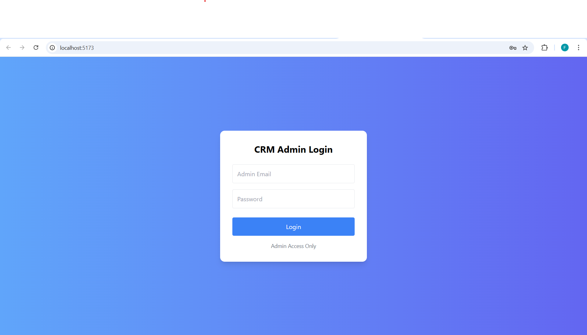
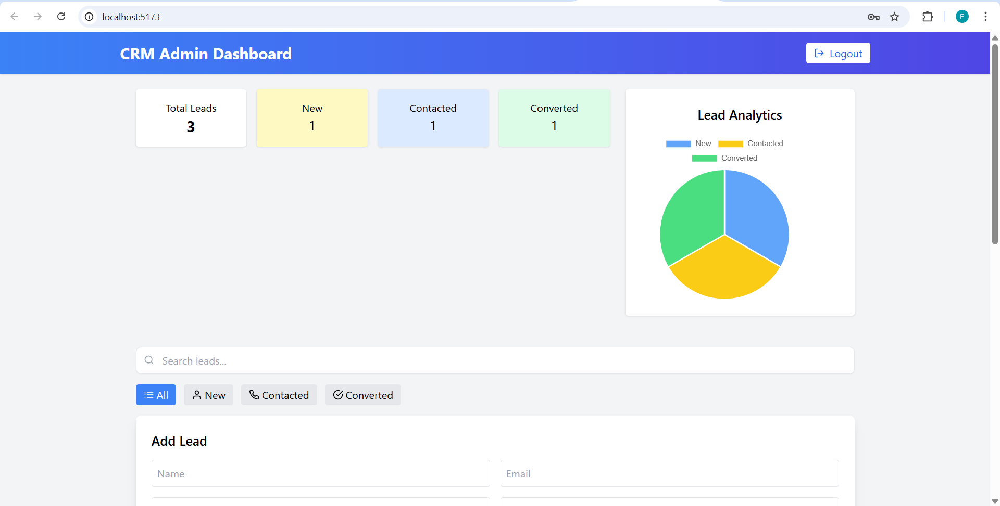
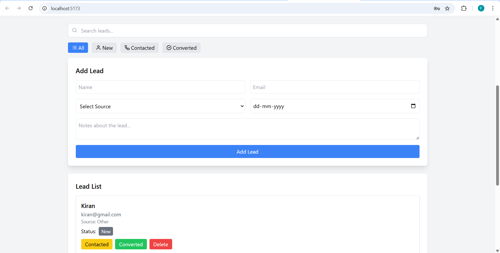
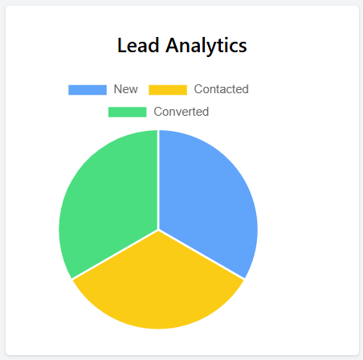

# 🚀 CRM Lead Manager


A simple **Client Relationship Management (CRM) system** to manage client leads generated from website contact forms.

This project was built as part of the **Future Interns Full Stack Development Internship Task**.

---

# 📌 Features

## 🔐 Authentication
- Admin login access
- Secure dashboard access
- Logout functionality

## 📊 Dashboard
- Total Leads
- New Leads
- Contacted Leads
- Converted Leads

## 📈 Analytics
- Lead analytics chart
- Visual representation of lead status

## 🧑‍💼 Lead Management
- Add new leads
- Update lead status
- Delete leads
- Add notes
- Follow-up reminders

## 🔎 Filtering & Search
- Search leads
- Filter by status:
  - All
  - New
  - Contacted
  - Converted

## 🎨 UI
- Responsive design
- Tailwind CSS styling
- Clean dashboard layout

---

# 🖥 Screenshots

### Login Page


### Dashboard


### Add Lead Form


### Analytics Chart


---

# 🔑 Admin Login Credentials

Use the following credentials to access the admin dashboard:

Email: admin@crm.com  
Password: admin123

---

# 🛠 Tech Stack

## Frontend
- React (Vite)
- Tailwind CSS
- Axios
- React Icons
- Chart.js

## Backend
- Node.js
- Express.js

## Database
- MongoDB Atlas

---

# ⚙ Installation

## 1️⃣ Clone Repository

```bash
git clone https://github.com/m-fani-goud/FUTURE_FS_01.git
cd FUTURE_FS_01
---

## 2️⃣ Backend Setup

```bash
cd backend
npm install
npm start
```

Backend server runs on:

```
http://localhost:5000
```

---

## 3️⃣ Frontend Setup

```bash
cd frontend
npm install
npm run dev
```

Frontend runs on:

```
http://localhost:5173
```

---

# 📂 Project Structure

```
FUTURE_FS_01
│
├── backend
│   ├── models
│   ├── routes
│   ├── server.js
│   └── package.json
│
├── frontend
│   ├── src
│   │   ├── components
│   │   ├── pages
│   │   ├── api.js
│   │   └── App.jsx
│   │
│   └── package.json
│
├── screenshots
│   ├── login.png
│   ├── dashboard.png
│   ├── add-lead.png
│   └── analytics.png
│
└── README.md
```

---

# 🎯 Internship Task

This project was built for the **Future Interns Full Stack Development Internship**.

Task Objective:

Build a simple CRM application to manage client leads generated from website contact forms.

---

# 👨‍💻 Author

**Fani Mandala**

GitHub:  
https://github.com/m-fani-goud

---

# ⭐ Support

If you like this project, please give it a ⭐ on GitHub.